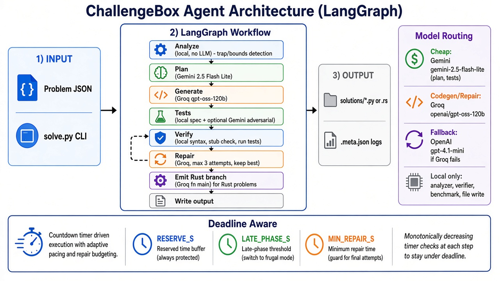

# ChallengeBox agent architecture

This repo is an AI coding agent for trap-heavy algorithmic problems. The grader scores hidden tests we never see. Sample JSON files ship **no public examples**. The agent must read a spec, find traps, generate stdlib code, verify locally, repair if needed, and write a solution before `deadline_s`.

The control loop is a small **LangGraph** state machine. The brains of each step stay in ordinary Python modules. There is no CrewAI and no extra agent swarm.



## Pipeline

```text
problem JSON
  → analyze (local)
  → plan (Gemini lite)
  → generate (Groq 120b)
  → tests (local spec + optional Gemini adversarial)
  → verify (local)
       ├─ fail + time left → repair (Groq) → verify
       ├─ Rust target → emit fn main() (Groq)
       └─ write solutions/<name>.py or .rs + .meta.json
```

`python3 solve.py <problem.json>` is the only entrypoint. It calls `Orchestrator.solve_file`, which builds deadline state and `invoke`s the compiled graph in `agent/graph.py`.

## Why LangGraph is here

LangGraph owns **edges**, not prompts:

- verify → repair when tests fail and the deadline still allows another attempt
- verify → emit_rust when the source language is Rust
- otherwise → write the best candidate so far

Keep-best repair (reject a worse rewrite) lives inside the repair node. Analyzer, planner, generator, and verifier are unchanged node bodies.

## Model routing

| Job | Provider | Model |
|---|---|---|
| Plan, adversarial test ideas | Gemini | `gemini-2.5-flash-lite` |
| Python / Rust generation, repair | Groq | `openai/gpt-oss-120b` |
| Groq 429 or empty | OpenAI | `gpt-4.1-mini` |
| Trap extraction, spec tests, stub check, benchmark, disk write | none | local |

Gemini is not used for final codegen. OpenAI is not used for plan/tests. `agent/models.py` tries: requested provider → Groq → OpenAI → local fallback text.

Keys (never logged): `GROQ_API_KEY`, `GROQ_API_KEY_2`, `GEMINI_API_KEY`, `OPENAI_API_KEY` in `.env`.

## Stages

**Analyze** (`agent/analyzer.py`). No LLM. Parses entrypoint, Python vs Rust, huge bounds (`10**18`, `200,000`, …), materialization warnings, wording traps, and a difficulty tag.

**Plan** (`agent/planner.py`). Cheap Gemini JSON: approach, structures, complexity target, traps, test ideas. Falls back to a local heuristic plan.

**Generate** (`agent/generator.py`). Python stdlib function named by the spec. Rust samples first get a Python `solve(stdin) -> str` prototype, then a `fn main()` program.

**Tests** (`agent/verifier.py` + `GenerateTestsTool`). Spec cases with expected values derived from the statement (empty, invalid, implicit error, …). Optional adversarial cases from Gemini. Adversarial mismatches are **soft** so a wrong LLM expected value cannot fail a spec-correct solution.

**Verify**. Syntax, required entrypoint, stub/echo rejection, subprocess run with timeout, expected-value compare. Static ban on `range(10**18)`-style loops.

**Repair**. Up to 3 attempts. Keep the higher-scoring candidate. Near the deadline (`LATE_PHASE_S` / `MIN_REPAIR_S`), skip more LLM work and write whatever is best.

**Write**. Always emits a file before the clock hits `RESERVE_S`. `.meta.json` records traps, plan, usage by provider/tier, graph node names, and every timed event.

## Tools

Generic `Tool` interface in `agent/tools.py`. The graph decides `should_use`:

- `read_problem`
- `analyze_constraints`
- `generate_tests`
- `run_solution`
- `inspect_failure`
- `benchmark_solution` (skipped if tests still fail or time is short)

## Deadline

`deadline_s` from the problem JSON (300s on samples) is first-class. Logs look like:

```text
[  21.80s | rem  278.20s] generate: python chars=8619 model=openai/gpt-oss-120b provider=groq
```

## Repository layout

```text
solve.py                 CLI
agent/graph.py           LangGraph nodes and edges
agent/orchestrator.py    deadline + invoke
agent/analyzer.py        local trap detection
agent/planner.py         structured plan
agent/generator.py       Python / Rust codegen
agent/verifier.py        tests + stubs
agent/repair.py          failure → rewrite
agent/models.py          Gemini / Groq / OpenAI
agent/tools.py           observable tools
agent/config.py          models, timeouts, repair limits
samples/                 original challenge JSON
problems/                numbered copies of the same fixtures
solutions/               generated code + .meta.json
tests/test_architecture.py
```

## Language rules (grader)

- **Python:** define `entrypoint`, stdlib only, no I/O.
- **Rust:** complete `fn main()`, stdin/stdout, stdlib only.
- Hidden tests include max-size inputs. Local `verified=True` is **not** the hidden score. Sample JSON has `"public_examples": []`.

## Run

```bash
pip3 install -r requirements.txt
python3 tests/test_architecture.py
python3 solve.py samples/<id>.json
python3 solve.py --all
```
